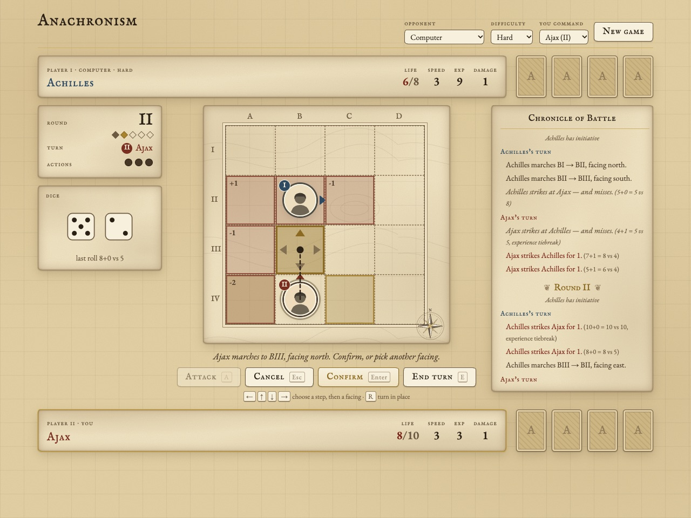

# Anachronism Sim

A digital simulator for *Anachronism*, the tactical CCG published 2004–2007 by TriKing Games in partnership with the History Channel. Warriors from across history meet on a grid where position and facing matter: combatants are moveable and facing-aware, and combat resolves through initiative, reveal timing, and attack/defense modifiers. The simulator targets three modes of play — solo against a bot, local hotseat (1v1 and up to 4 players), and online multiplayer.

## Status: Milestone 8 — Online multiplayer (current)

Done: M1+M2 (card database, 761 cards from `spreadsheet-2007`), **M4** (headless 1v1 engine spine), **M6** (minimal playable hotseat UI), **M5** (search-based bot opponent, Easy/Medium/Hard), and **M7** (cartography UI with click-driven board and the bot wired in). M3 (data cross-check) is deferred. The engine ([`engine/`](engine/README.md)) is a pure-function, fully-tested TypeScript core (113 tests): 4×4 arena, facing/rotation (incl. the free rotate on move), attack-grid projection, 2d6 combat with crits, the 5-round initiative loop, all win conditions, seeded-RNG determinism, `getLegalActions`, stubbed ability hook-points, and the bot (`chooseAction(state, difficulty, botSeed)`). The UI ([`ui/`](ui/)) is a React+Vite client in an aged-map / parchment art direction that imports the engine directly — all rules stay in the engine.

## Project Structure

- `docs/` — schema, data-source, and roadmap documentation.
- `data/` — generated card data: per-set JSON, the combined index, and the review queue.
- `scraper/` — builders that turn the source data into schema-valid JSON (`build_from_spreadsheet.py`, the live source of truth; `parse_cards.py`, the historical Heard parser).
- `engine/` — headless, pure-function 1v1 game engine (TypeScript). See [`engine/README.md`](engine/README.md).
- `ui/` — minimal React + Vite hotseat UI over the engine (imports `engine/` by local path; no duplicated logic).
- `schema/` — JSON Schema definitions for card objects.
- `.github/` — issue templates (epic / task).

## Running the UI

```bash
cd ui && npm install && npm run dev    # serves at http://localhost:5173
```

Play against the computer (Easy / Medium / Hard, either warrior) or hotseat with two players on one
screen. On your turn, reachable cells glow on the map: click one to draw your path, pick a facing from
the carets (the attack grid previews for each), and confirm. Click your own warrior to turn in place,
or an enemy in range to attack. Keys: arrows pick a step then a facing, Enter confirm, Esc cancel,
A attack, R turn in place, E end turn. The chronicle narrates every move and blow until a winner is
declared. Support-card slots and the dice tray are placeholders for later milestones.



`cd engine && npm test` runs the engine's 113-test suite; `npm run selfplay` pits the bot tiers against each other.

## Data Sources

See [docs/DATA_SOURCES.md](docs/DATA_SOURCES.md).

## Roadmap

See [docs/ROADMAP.md](docs/ROADMAP.md).

## Tech (intended, TENTATIVE — not committed)

TypeScript engine; renderer TBD (Phaser or canvas); browser-first, then Raspberry Pi 4 kiosk, then online multiplayer.

## Agents

- **Galvani** (Claude Enterprise) — product management / planning, with Paul.
- **Gloom** (Cursor) — implementation.
- **Asterion** (Claude Code) — implementation.
